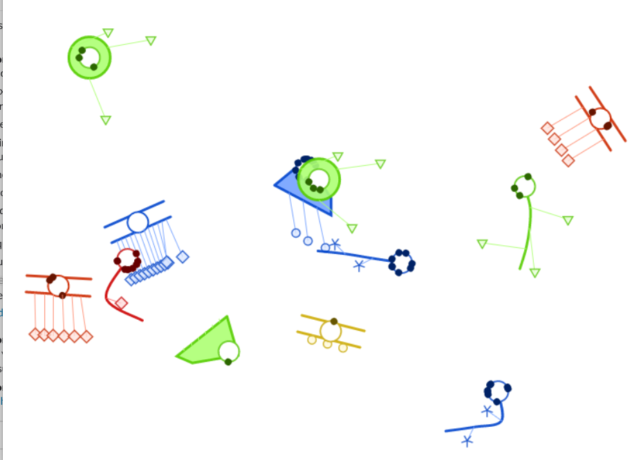

# Creature 

Customizable creature in Processing.js.

Use the code in [Paysage](https://github.com/jonathanperret/paysage) for collective coding crazyness.

Created for the *Code Creature Live Party* workshop that will take place at Pompidou Center during *La Fête du Code Créatif* (Creative Coding Party/Fest) on November 28th-29th 2015.