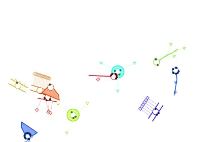

# Creature 

Customizable creature in Processing.js.

Use it with [Paysage](https://github.com/jonathanperret/paysage) for collective coding crazyness:

* Open [a random Paysage Programmer ](http://paysage.xyz) (and send its URL to some friends!)
* Copy and paste [the Creature class code](https://raw.githubusercontent.com/FeteCodeCreatif/creature/master/creature/creature.pde) in the editor
* Add your Creature instance code under the "//kids code here" line, using the [example from the leaflet](https://github.com/FeteCodeCreatif/creature/blob/master/assets/CodeCreatures_Depliant.pdf). Example: *macreature.corps(atome).yeux(1).nombredebras(insecte).tailledebras(patte).main(etoile).couleurs(25);*
* Click "Go live", open the Playground full screen on your phone/tablet/other computer for more fun by going to its URL (paysage.xyz/playground/…)
* It's way more fun to play with friends, each one coding their creature on their own Programmer, sending them all to the same Playground. But you can also play alone by sending multiple Creature to the Playground. Just give your code another name, and it will be a new Creature.

Created for the **Code Créature** workshop that took place at *Pompidou Center* during **La Fête du Code Créatif** (Creative Coding Party/Fest) on November 28th-29th 2015.

Creature is designed and programmed by Benjamin Bartholet [@telohtrab](http://twitter.com/telohtrab) in collaboration with Julien Dorra [@juliendorra](http://twitter.com/juliendorra) and Odile Fayet (Project Lead at Pompidou Center).

We welcome feedbacks, improvements, and forks ;-)
